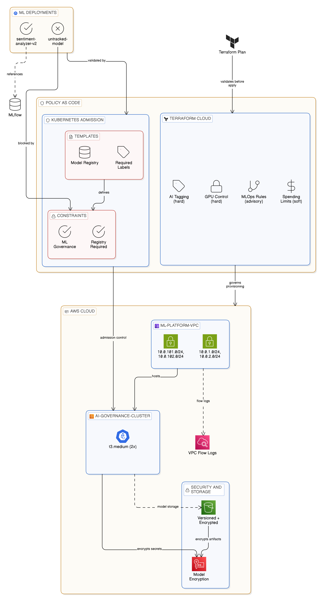

# AI/ML Governance with Policy-as-Code

Dual-layer policy enforcement for AI infrastructure: Sentinel blocks non-compliant Terraform plans before provisioning, while OPA Gatekeeper rejects ML deployments missing governance labels at the Kubernetes admission stage.

## Overview

Organisations deploying ML models face a governance gap—anyone with cluster access can deploy expensive GPU workloads or push untracked models to production. Without controls, a single p3.8xlarge instance could run up £8,800/month, and untraceable model versions make rollbacks impossible.

This project implements policy-as-code at two enforcement points. HashiCorp Sentinel integrates with HCP Terraform to evaluate infrastructure plans before any resources are created. Policies block GPU instances without explicit approval, enforce mandatory tagging for cost attribution (ML-Team, Model-Type, Owner), and cap monthly spend at configurable thresholds. At the Kubernetes layer, OPA Gatekeeper admission webhooks reject any Deployment lacking model-version and ml-team labels, and require production ML workloads to reference an approved model registry (MLflow, Kubeflow, or SageMaker).

The infrastructure deploys an EKS cluster with encryption-at-rest for secrets, VPC flow logs for audit trails, and an S3 bucket with versioning enabled for model artifact storage—demonstrating that governance isn't bolted on but designed into the platform from the start.

## Architecture

Terraform provisions the AWS infrastructure through HCP Terraform, where Sentinel policies evaluate every plan before apply. The policy set includes four policies: GPU instance control (hard-mandatory), AI resource tagging (hard-mandatory), spending limits (soft-mandatory), and model deployment rules (advisory).

Once infrastructure exists, OPA Gatekeeper runs as a Kubernetes admission controller on the EKS cluster. Two ConstraintTemplates define the governance rules: `K8sRequiredLabels` enforces mandatory ML tracking labels, while `MLModelRegistry` requires production deployments to include a model-registry-url annotation. Any kubectl apply that fails these constraints is rejected before the pod is scheduled.

The flow is: Developer commits Terraform → HCP Terraform runs plan → Sentinel evaluates → (pass/fail) → Infrastructure provisioned → Developer applies K8s manifest → OPA Gatekeeper evaluates → (pass/fail) → Workload deployed.

## Tech Stack

**Infrastructure**: AWS EKS, VPC with flow logs, KMS encryption, S3 with versioning  
**Policy Enforcement**: HashiCorp Sentinel (Terraform plans), OPA Gatekeeper (Kubernetes admission)  
**Platform**: HCP Terraform, Kubernetes 1.28  
**Security**: Cluster encryption, IRSA, network segmentation for MLflow/TensorBoard ports  

## Key Decisions

- **Dual enforcement layers**: Sentinel catches infrastructure violations before provisioning (preventing costly mistakes), while OPA catches runtime violations at deployment (preventing governance drift). Neither alone provides complete coverage.

- **Hard-mandatory for cost controls**: GPU instance control and tagging policies use hard-mandatory enforcement because the cost of a violation (£2,000+/month) exceeds the inconvenience of blocking a legitimate deployment that needs fixing.

- **EU AI Act compliance built-in**: Tags include AI-Risk-Level and Compliance-Review fields anticipating regulatory requirements. High-risk AI systems require documented risk assessments before deployment—enforced by policy, not process.

- **Model registry as deployment gate**: Production ML deployments must reference an approved registry URL. This prevents "works on my machine" model deployments and ensures every production model is versioned and reproducible.

## Screenshots

## Author

**Noah Frost**

- Website: [noahfrost.co.uk](https://noahfrost.co.uk)
- GitHub: [github.com/nfroze](https://github.com/nfroze)
- LinkedIn: [linkedin.com/in/nfroze](https://linkedin.com/in/nfroze)